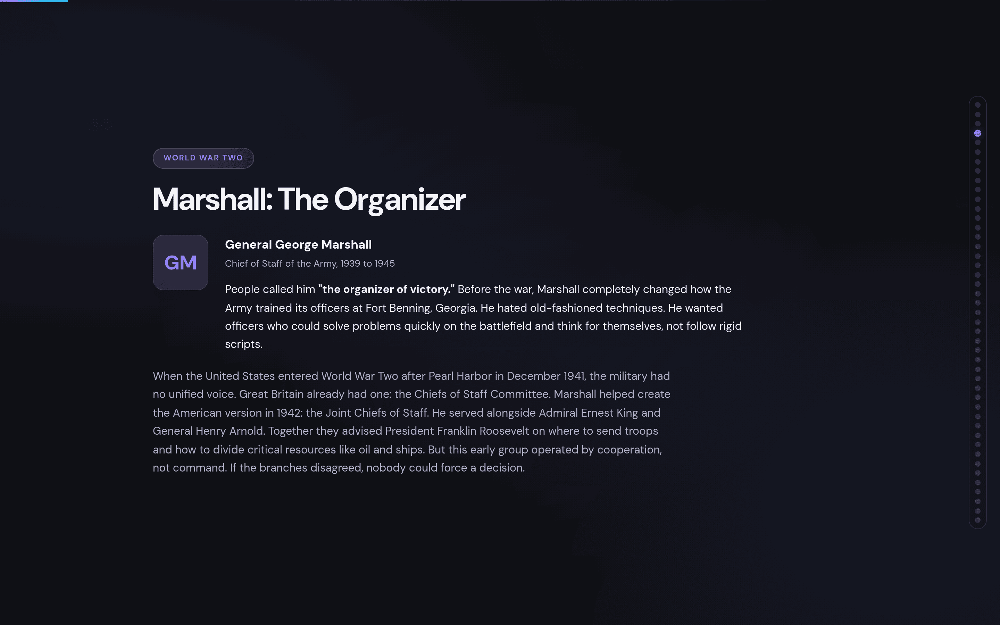
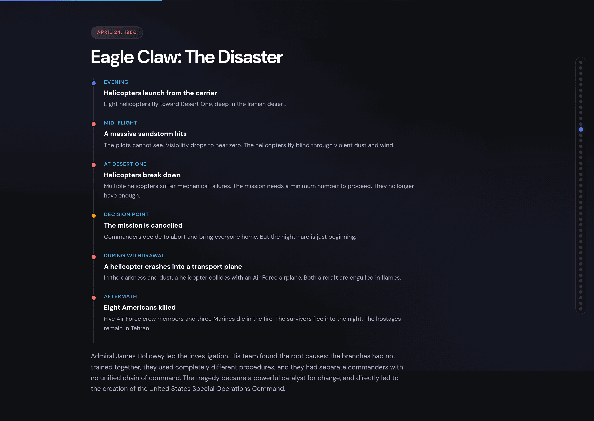
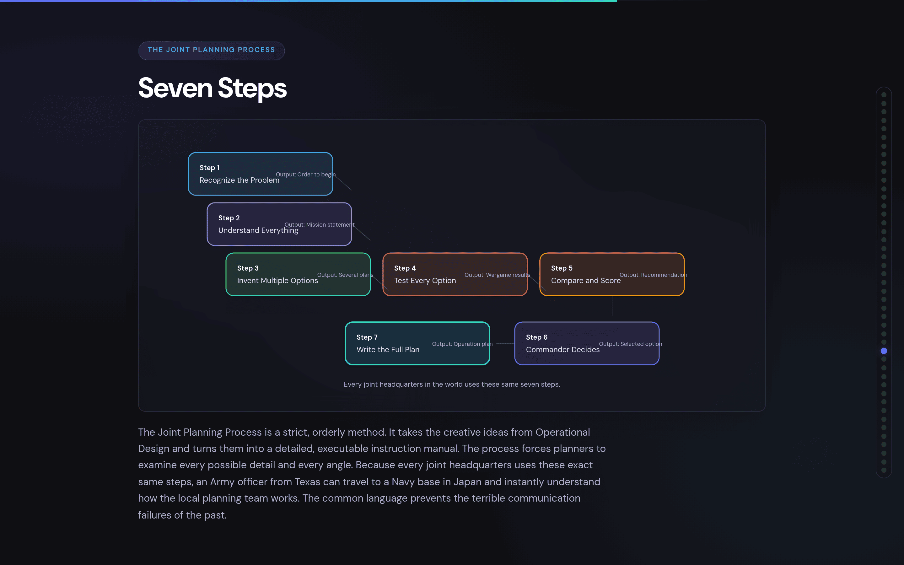
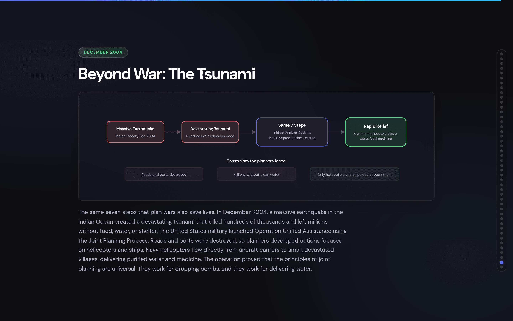

# HTML Slide Builder

Build self-contained HTML slide decks with inline SVG diagrams from source documents. Give it design docs, ERDs, meeting notes, or research and get back a polished visual presentation that opens with a double-click.

## Features

- **Self-contained HTML** — single file, no build step, no server, no external dependencies (Google Fonts only)
- **Graphics-first** — every slide leads with an inline SVG diagram, chart, or visual; text is annotation only
- **Dark theme** — layered radial gradients, frosted-glass cards, polished typography
- **Keyboard navigation** — arrow keys, spacebar, page up/down with smooth scroll-snap
- **Nav dots + progress bar** — auto-generated from slide count with title tooltips
- **Incremental build** — HTML is constructed in successive rounds to handle large decks reliably

## Installation

```bash
/plugin marketplace add scaleapi/claude-code
/plugin install html-slide-builder@scale-ai
```

## Usage

Just ask Claude to build a presentation from your source material:

> "Turn these design doc notes into a slide deck"

> "Make a presentation from this ERD for the architecture review"

> "Build slides from this research document for the team offsite"

Claude will read your sources, ask clarifying questions about audience and intent, propose a narrative arc, then build the HTML file in rounds.

## Example Output

Screenshots from a 45-slide deck on the history of joint military planning, built entirely by the skill from a source document ([view the live deck](https://jac-marais.github.io/presentations/joint-planning-history.html)):

| | |
|---|---|
|  |  |
|  |  |



## MCP Server: Slide Capture (optional)

The plugin includes an MCP server that exports HTML decks to PDF or PNG images using headless Chromium in Docker. To enable it, add to `~/.claude/mcp.json`:

```json
{
  "mcpServers": {
    "slide-capture": {
      "command": "node",
      "args": ["/path/to/plugins/html-slide-builder/mcp/server.mjs"]
    }
  }
}
```

**Requirements:** Docker must be running. The server auto-builds a Chromium image on first use.

**Tools provided:**

| Tool | Description |
|------|-------------|
| `inspect_presentation` | List numbered slide titles from an HTML deck |
| `export_presentation` | Export to PDF or individual PNGs. Supports single slide, subset, range, or full deck |

**Usage examples:**

> "Export this deck to PDF"

> "Capture slides 3-8 as PNG images"

> "Inspect the presentation to see slide titles"

## When to use this vs presentation-maker

| | html-slide-builder | presentation-maker |
|---|---|---|
| **Output** | Self-contained HTML file | PowerPoint (.pptx) |
| **Visuals** | Inline SVG diagrams, charts | Scale-branded slide layouts |
| **Dependencies** | None (just a browser) | Python, python-pptx, Scale template |
| **Best for** | Technical narratives, architecture proposals, leave-behind decks | Team updates, client decks, branded presentations |
| **Theme** | Dark, visual-heavy | Scale corporate branding |

## Workflow

The skill follows a structured 6-phase process:

1. **Intake** — read and inventory all source documents
2. **Audience & Intent** — determine narrative posture and emotional arc
3. **Narrative Arc** — structure the story, get user approval on outline
4. **Slide Plan** — detailed per-slide content spec with graphic types
5. **Build** — write HTML in successive rounds (shell, then 4-8 slides per round)
6. **Review & Refine** — iterate with user feedback
